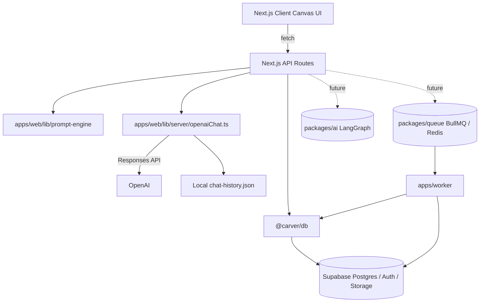

# CarverAI

CarverAI is an AI-powered landscape design platform for landscape engineers, garden studios, designers, and homeowners. It combines project-based canvas work, reference images, AI chat, prompt engineering, and a planned asynchronous AI job pipeline to help users create controlled garden and landscape concepts without losing real-world layout constraints.

## Overview

CarverAI is being built as an **AI Landscape Architect Co-Pilot** rather than a generic image generator. The core workflow is canvas-first: users create projects, add or paste site images, sketch or select regions, preserve important spatial elements, chat with an AI assistant, generate or refine landscape concepts, and save versioned canvas snapshots.

The current repository is a TypeScript monorepo with a Next.js web app, shared database utilities, early AI orchestration packages, and a worker scaffold for future long-running image jobs.

## Fast Agent Start

If you are an agent or onboarding contributor, read [context.md](/E:/Carver-AI/context.md) first.

That file summarizes:
- product intent
- package ownership
- canvas architecture
- preset-group workflow
- graph-aware generation context
- chat image-input flow
- the most important files to inspect first for each task

## Current Implementation Status

The repo has moved beyond a simple demo canvas in several important areas:

- Canvas graph context exists.
  Image nodes, preset-group nodes, and edges are used to build generation context.
- Preset library uses `presetGroup` nodes.
  Presets are no longer treated as single dropped images on the canvas.
- Chat can now bind to the selected canvas image.
  The right chat panel can attach the selected canvas image plus connected references as AI context.
- Chat image understanding is partially implemented.
  The chat route now supports sending image inputs to OpenAI for image description and analysis.
- Snapshot schema includes graph data.
  Shared snapshot types now support graph nodes, graph edges, and active generation target state.
- Generation pipeline is MVP-level, not finished.
  Graph-aware generation contracts exist, but the full production image pipeline is still incomplete.

## Key Features

| Area                   | Current / Planned Capability                                                                                                                                                                    |
| ---------------------- | ----------------------------------------------------------------------------------------------------------------------------------------------------------------------------------------------- |
| Project workspace      | Project creation route and database model for landscape projects, briefs, chat threads, assets, snapshots, AI jobs, design versions, and exports.                                               |
| Infinite canvas        | Desktop canvas with pan, zoom, cursor-centered zoom, image nodes, marquee selection, drag, pen strokes, markers, editable/locked regions, and contextual tooling.                               |
| Reference workflow     | Users can paste or import images, build graph connections, and use preset-group reference nodes on the canvas. Full remote asset persistence is still evolving.                                 |
| AI chat assistant      | Canvas chat panel connected to `/api/chat`, using OpenAI Responses API for landscape design guidance and image-aware chat input.                                                                 |
| Prompt engine          | Deterministic landscape prompt compiler that detects task type, edit scope, target area/object, risk level, preservation rules, negative constraints, and edit brief metadata.                  |
| Spatial lock system    | Canvas supports editable and locked regions as a product concept; database schema includes tables for future spatial constraints, but a dedicated `spatial_locks` table is not yet implemented. |
| Versioned canvas state | Database schema stores `canvas_snapshots` as versioned JSON rows. Shared snapshot schema already includes graph state; full end-to-end persistence wiring is still in progress.                  |
| AI generation pipeline | `packages/ai`, `packages/queue`, and `apps/worker` now include graph-aware generation contracts and brief-building helpers. The full production image pipeline is still not fully implemented.    |
| Gallery / review pages | Static marketing and project review pages exist under `apps/web/app`, including gallery, reviews, submit, engineers, styles, and project detail routes.                                         |

## Product Vision

CarverAI helps landscape professionals turn rough site photos, sketches, reference images, and informal prompts into controlled design concepts.

The product should preserve what matters in real landscape work:

- original camera angle and perspective;
- house, pond, rockery, gazebo, path, wall, and boundary positions;
- object scale and proportions;
- editable versus preserved areas;
- reference image roles;
- planting, material, budget, climate, and constructability constraints.

The intended user experience is closer to a lightweight design tool than a chatbot: the canvas is the workspace, AI supports design decisions, and every meaningful design action should be traceable through versions, assets, prompts, and jobs.

## Tech Stack

| Layer            | Technology                                                        |
| ---------------- | ----------------------------------------------------------------- |
| Monorepo         | npm workspaces, Turborepo                                         |
| Web app          | Next.js App Router, React, TypeScript                             |
| Styling          | Tailwind CSS, PostCSS, GSAP, Framer Motion, Lucide React          |
| Database         | Supabase Postgres, Supabase Auth, Supabase Storage, Prisma client |
| AI orchestration | LangGraph                                                         |
| Chat model       | OpenAI Responses API                                              |
| Queue            | BullMQ                                                            |
| Worker           | TypeScript Node worker                                            |
| Deployment       | Vercel configuration for the web app                              |
| Package manager  | npm 10.9.3                                                        |
| Runtime          | Node.js `>=20.9.0`                                                |

## System Architecture



### Current runtime notes

- The web app is the active product surface.
- Chat history is currently persisted locally in `apps/web/data/chat-history.json`, not Supabase.
- `packages/ai` contains an early LangGraph router state machine.
- `packages/queue` exposes BullMQ queue/worker helpers and Redis connection defaults.
- `apps/worker` starts a BullMQ worker but image-processing handlers are still TODO.

## Project Structure

```text
.
├─ apps/
│  ├─ web/
│  │  ├─ app/
│  │  │  ├─ api/              # Next.js route handlers for auth context, chat, projects, profiles, prompt enhancement, and generation
│  │  │  ├─ canvas/           # Canvas workspace, core board, panels, widgets, library, and canvas types
│  │  │  ├─ gallery/          # Landing/gallery shell, components, and sample project data
│  │  │  ├─ projects/[slug]/  # Project detail page
│  │  │  ├─ submit/           # Project submission page
│  │  │  ├─ reviews/          # Review/gallery culture page
│  │  │  ├─ engineers/        # Engineer-facing page
│  │  │  ├─ ai-tools/         # AI tools page
│  │  │  ├─ styles/           # Styles page
│  │  │  ├─ page.tsx          # Home page
│  │  │  └─ layout.tsx        # Root layout
│  │  ├─ data/               # Static feature data and local chat history
│  │  ├─ lib/
│  │  │  ├─ prompt-engine/   # Deterministic landscape prompt enhancement and final prompt compilation
│  │  │  └─ server/          # Server-only chat history and OpenAI chat helpers
│  │  ├─ public/assets/      # Static canvas/gallery assets
│  │  ├─ package.json
│  │  ├─ next.config.mjs
│  │  ├─ tailwind.config.ts
│  │  └─ tsconfig.json
│  └─ worker/
│     ├─ src/index.ts        # BullMQ worker scaffold
│     ├─ package.json
│     └─ tsconfig.json
├─ packages/
│  ├─ ai/
│  │  ├─ src/graph.ts        # LangGraph state graph scaffold
│  │  ├─ src/state.ts        # Carver intent/prompt state
│  │  └─ src/nodes/router.ts # Intent router for chat, generate, refine, and reference analysis
│  ├─ db/
│  │  ├─ sql/                # Supabase schema and RLS migration SQL
│  │  └─ src/                # Supabase client helpers, Prisma singleton, env readers, and generated-style types
│  ├─ queue/
│  │  └─ src/index.ts        # BullMQ exports and Redis connection defaults
│  └─ config/
│     └─ package.json        # Placeholder shared config package
├─ scripts/openai_demo/      # Standalone OpenAI demo script
├─ package.json              # Root npm workspaces and Turbo scripts
├─ turbo.json                # Turbo task configuration
├─ vercel.json               # Vercel web deployment configuration
└─ .gitignore
```

## Getting Started

### Prerequisites

- Node.js `>=20.9.0`
- npm 10.x
- Supabase project with Auth, Postgres, and Storage enabled
- OpenAI API key for canvas chat
- Redis server for queue/worker development
- Supabase CLI or SQL console for applying migrations

### Installation

```bash
npm install
```

Install dependencies for the standalone OpenAI demo if needed:

```bash
python -m venv scripts/openai_demo/.venv
scripts/openai_demo/.venv/Scripts/Activate.ps1
pip install -r scripts/openai_demo/requirements.txt
```

### Environment Variables

CarverAI intentionally uses one local `.env` file. The file is ignored by Git.

Required variables:

| Variable                        | Scope              | Purpose                                                            |
| ------------------------------- | ------------------ | ------------------------------------------------------------------ |
| `NEXT_PUBLIC_SUPABASE_URL`      | Client/server      | Supabase project URL. Browser code may use this.                   |
| `NEXT_PUBLIC_SUPABASE_ANON_KEY` | Client/server      | Supabase anon/public key. Browser code may use this.               |
| `SUPABASE_SERVICE_ROLE_KEY`     | Server/worker only | Server-side Supabase admin access. Never import into browser code. |
| `OPENAI_API_KEY`                | Server only        | OpenAI Responses API key for canvas chat.                          |

Optional infrastructure variables:

| Variable         | Scope         | Purpose                                         |
| ---------------- | ------------- | ----------------------------------------------- |
| `DATABASE_URL`   | Server/Prisma | Supabase pooled Postgres connection.            |
| `DIRECT_URL`     | Server/Prisma | Supabase direct Postgres connection.            |
| `REDIS_HOST`     | Queue/worker  | Redis host for BullMQ. Defaults to `localhost`. |
| `REDIS_PORT`     | Queue/worker  | Redis port for BullMQ. Defaults to `6379`.      |
| `REDIS_USERNAME` | Queue/worker  | Redis username when required.                   |
| `REDIS_PASSWORD` | Queue/worker  | Redis password when required.                   |

Do not commit `.env`, `.env.local`, keys, signed URLs, prompts, job payloads, access tokens, refresh tokens, or service-role credentials.

### Run Development Server

Run the full monorepo dev stack:

```bash
npm run dev
```

Run only the web app:

```bash
npm run dev --workspace=@carver/web
```

Run the worker:

```bash
npm run dev --workspace=@carver/worker
```

### Build Production

Build all packages and apps:

```bash
npm run build
```

Run TypeScript checks:

```bash
npm run typecheck
```

Run lint/static checks:

```bash
npm run lint
```

Vercel is configured to build the web app with:

```json
"buildCommand": "npx turbo run build --filter=@carver/web..."
```

## Database

CarverAI uses Supabase as the source of truth. The database package provides typed Supabase clients and Prisma helpers.

### Schema

SQL migrations live in `packages/db/sql`:

| File                         | Purpose                                                        |
| ---------------------------- | -------------------------------------------------------------- |
| `001_canvas_chat_schema.sql` | Creates enums, tables, indexes, triggers, and storage buckets. |
| `002_rls_policies.sql`       | Enables RLS and defines owner/project ownership policies.      |

Core tables include:

| Table              | Purpose                                                                                            |
| ------------------ | -------------------------------------------------------------------------------------------------- |
| `profiles`         | User profile, plan type, credits, onboarding metadata.                                             |
| `projects`         | Project owner, name, description, status, current snapshot, and landscape goal.                    |
| `landscape_briefs` | Site and design requirements such as property type, climate, budget, style preferences, and notes. |
| `canvas_snapshots` | Versioned canvas JSON snapshots for a project.                                                     |
| `assets`           | Uploaded, generated, reference, or exported assets with storage metadata.                          |
| `chat_threads`     | Project-level chat threads.                                                                        |
| `chat_messages`    | User and assistant messages with optional asset/canvas references.                                 |
| `ai_jobs`          | Future async AI job records for generation, refinement, analysis, and export.                      |
| `design_versions`  | Source/output snapshot and job relationships.                                                      |
| `exports`          | Export records for PNG, JPG, and PDF outputs.                                                      |

Storage buckets created by the schema:

| Bucket             | Purpose                              |
| ------------------ | ------------------------------------ |
| `project-uploads`  | Private user uploads and references. |
| `generated-assets` | Private generated assets.            |
| `exports`          | Private export files.                |

### Applying the schema

Apply the SQL files to your Supabase project using the Supabase SQL editor or Supabase CLI. After applying schema changes, regenerate `packages/db/src/types.ts` from the real Supabase project when available.

### Row Level Security

RLS is enabled for all user-owned tables in `002_rls_policies.sql`. Policies are based on:

- `auth.uid()` for profile ownership;
- `projects.owner_id` for project ownership;
- `public.is_project_owner(project_id)` for project-scoped records;
- storage folder ownership for private buckets.

## AI Services

### Canvas Chat

`apps/web/app/api/chat/route.ts` handles chat history and OpenAI completion requests.

Current behavior:

- `GET /api/chat` loads chat history from `apps/web/data/chat-history.json`.
- `POST /api/chat` calls `apps/web/lib/server/openaiChat.ts`.
- `DELETE /api/chat` clears history for the current canvas/project.
- The OpenAI chat helper uses the Responses API endpoint `https://api.openai.com/v1/responses`.
- The current model is configured as `gpt-5-mini`.

Known limitation: chat history is local-file based and is not yet connected to Supabase chat tables.

### Prompt Engine

The prompt engine is in `apps/web/lib/prompt-engine`.

Key exports:

| Export                     | Purpose                                                |
| -------------------------- | ------------------------------------------------------ |
| `enhancePromptDraft()`     | Produces an editable enhanced draft before generation. |
| `compileFinalPrompt()`     | Builds the guarded final prompt used by generation.    |
| `enhanceLandscapePrompt()` | Core deterministic prompt compiler.                    |

The prompt engine detects:

- task type;
- edit scope;
- target area/object;
- risk level;
- preservation rules;
- negative constraints;
- formula used;
- edit brief metadata.

Current routes:

| Route                      | Purpose                                              |
| -------------------------- | ---------------------------------------------------- |
| `POST /api/prompt/enhance` | Enhances a raw prompt and returns draft metadata.    |
| `POST /api/generate`       | Compiles a final prompt and returns prompt metadata. |

Known limitation: `/api/generate` currently returns `result: null`; no server-side image/design model is wired yet.

### LangGraph and AI Orchestration

`packages/ai` contains an early LangGraph graph:

- `CarverStateAnnotation` tracks intent and prompt.
- `routeIntent()` classifies prompts into `chat`, `generate`, `refine`, or `analyze_reference`.
- The graph currently routes from `START` to `router` to `END`.

Future graph nodes may include intent classification, context collection, spatial constraint building, reference interpretation, prompt building, model routing, job creation, result persistence, and version creation.

### Queue and Worker

`packages/queue` provides BullMQ exports and Redis connection defaults. `apps/worker` starts an `image-processing` worker.

Known limitation: worker job handlers are not implemented yet. The worker currently logs job lifecycle events but does not generate, refine, analyze, or persist assets.

## Canvas System

The canvas lives in `apps/web/app/canvas`.

Current canvas capabilities include:

| Capability                                   | Files / Notes                                                                                                         |
| -------------------------------------------- | --------------------------------------------------------------------------------------------------------------------- |
| Workspace shell                              | `CanvasWorkspace.tsx`                                                                                                 |
| Pan, zoom, zoom-to-cursor, marquee selection | `CanvasBoard.tsx`                                                                                                     |
| Image nodes and node cards                   | `CanvasNodeCard.tsx`                                                                                                  |
| Edge creation                                | `CanvasEdges.tsx`                                                                                                     |
| Pen strokes                                  | `PenStrokeLayer.tsx` and `PenSettingsPopover.tsx`                                                                     |
| Mini map                                     | `MiniMap.tsx`                                                                                                         |
| Floating/contextual toolbar                  | `BottomToolDock.tsx`, `ContextualToolbar.tsx`                                                                         |
| Library panels                               | `LibrarySidebar.tsx`, `ObjectLibraryPanel.tsx`, `LibraryAssetGrid.tsx`                                                |
| Editing panels                               | `EditorLeftSidebar.tsx`, `EditorRightPanel.tsx`, `QuickEditModal.tsx`, `MultiAngleModal.tsx`, `RealityCheckPanel.tsx` |
| Spatial annotations                          | `MarkerPin.tsx`, `RegionOverlay.tsx`, `SketchLayer.tsx`, `SelectableImage.tsx`                                        |

The canvas is desktop-first and shows a mobile warning below `xl` breakpoint.

Known limitations:

- Canvas state is currently local React state.
- Project creation exists in the API, but full canvas snapshot save/load is not wired end-to-end.
- Image upload/paste currently uses object URLs in the browser.
- AI concept generation currently creates mock concept placeholders in the UI.
- Spatial locks are represented as canvas regions but are not yet persisted as first-class records.

## API Structure

| Route                 | Methods                 | Purpose                                                                      | Auth                                             |
| --------------------- | ----------------------- | ---------------------------------------------------------------------------- | ------------------------------------------------ |
| `/api/chat`           | `GET`, `POST`, `DELETE` | Load, send, and clear canvas chat history.                                   | Not currently enforced.                          |
| `/api/prompt/enhance` | `POST`                  | Enhance raw landscape prompt into a structured draft.                        | Not currently enforced.                          |
| `/api/generate`       | `POST`                  | Compile final generation prompt and return prompt metadata.                  | Requires bearer token via `getRequestContext()`. |
| `/api/projects`       | `POST`                  | Create a project, initial canvas snapshot, landscape brief, and chat thread. | Requires bearer token via `getRequestContext()`. |
| `/api/profiles`       | `GET`                   | Load the current authenticated user's profile.                               | Requires bearer token via `getRequestContext()`. |

API helper modules:

| File                            | Purpose                                                                                    |
| ------------------------------- | ------------------------------------------------------------------------------------------ |
| `apps/web/app/api/_lib/auth.ts` | Extracts bearer token, validates Supabase user, and returns a user-scoped Supabase client. |
| `apps/web/app/api/_lib/http.ts` | Parses JSON requests and returns typed HTTP errors.                                        |

Security note: `GET /api/chat`, `POST /api/chat`, `DELETE /api/chat`, and `/api/prompt/enhance` currently do not enforce authentication. They should be secured before production use.

## Development Workflow

1. Inspect the relevant package and current behavior before editing.
2. Keep changes inside the package that owns the behavior.
3. Keep server-only code out of client bundles.
4. Keep database logic out of React UI components when possible.
5. Keep AI orchestration logic out of UI components.
6. Prefer small, testable functions and serializable canvas state.
7. Remove demo-only code instead of building around it.
8. Run checks before handoff when feasible:

```bash
npm run build
npm run typecheck
npm run lint
```

Package-level checks are also available:

```bash
npm run build --workspace=@carver/web
npm run typecheck --workspace=@carver/web
npm run lint --workspace=@carver/web

npm run build --workspace=@carver/worker
npm run typecheck --workspace=@carver/worker
```

## Deployment

The web app is configured for Vercel in `vercel.json`:

| Setting          | Value                                         |
| ---------------- | --------------------------------------------- |
| Framework        | Next.js                                       |
| Install command  | `npm install`                                 |
| Build command    | `npx turbo run build --filter=@carver/web...` |
| Dev command      | `npm run dev --workspace=@carver/web`         |
| Output directory | `apps/web/.next`                              |

Recommended deployment flow:

1. Apply Supabase SQL migrations in `packages/db/sql`.
2. Regenerate `packages/db/src/types.ts` from the live Supabase project when available.
3. Configure Supabase environment variables in the deployment environment.
4. Configure `OPENAI_API_KEY` for production.
5. Configure Redis environment variables if the queue/worker is deployed.
6. Deploy the Next.js app to Vercel or another Next.js-compatible host.
7. Deploy `apps/worker` separately where Redis connectivity and Node runtime are available.

Known limitation: the current Vercel configuration targets the web app. The BullMQ worker and Redis infrastructure are not yet configured for production deployment.

## Security Notes

CarverAI follows these security rules:

- Supabase Auth is the identity source. Do not create a parallel user table.
- Browser code may only use `NEXT_PUBLIC_SUPABASE_URL` and `NEXT_PUBLIC_SUPABASE_ANON_KEY`.
- `SUPABASE_SERVICE_ROLE_KEY` belongs only in server routes and workers.
- Import service-role helpers from `@carver/db/server`; never import them into browser code.
- API routes must check the authenticated user before reading or mutating project data.
- Do not log prompts, uploaded image URLs, storage paths with signed tokens, job payloads, access tokens, refresh tokens, or service-role keys.
- Every user-owned table must have RLS enabled before production use.
- Storage should remain private by default.
- Generate signed URLs only when needed and keep expiry short.
- Validate uploaded file type and size before accepting assets.
- Never trust client-supplied `user_id`, `owner_id`, or `project_id` without ownership checks.

Production hardening items still needed:

- Add authentication to chat and prompt enhancement routes.
- Move chat history from local JSON to Supabase.
- Wire canvas snapshot persistence to `canvas_snapshots`.
- Implement worker handlers without logging sensitive prompts or signed URLs.
- Confirm all storage policies match the intended private asset workflow.

## Roadmap

| Phase            | Focus                                                                                                                                 |
| ---------------- | ------------------------------------------------------------------------------------------------------------------------------------- |
| Foundation       | Secure API routes, Supabase Auth, project CRUD, chat persistence, canvas snapshot save/load.                                          |
| Canvas core      | Stable pan/zoom, image resize, object metadata, region locking, version preview, and restore.                                         |
| Prompt engine    | Keep deterministic prompt safety while adding clearer review/expert modes and richer reference handling.                              |
| AI job pipeline  | Create AI jobs from canvas/chat actions, queue long-running work, execute worker handlers, store outputs, and create design versions. |
| Spatial lock MVP | Persist locked regions/objects, include them in prompt generation, and prevent accidental edits.                                      |
| Asset workflow   | Supabase Storage upload, signed URL generation, generated asset persistence, export records.                                          |
| Product polish   | Project dashboard, version comparison, proposal preview, budget/reality-check scoring, engineer handoff flows.                        |

## Known Limitations

- No root README existed before this file; some documentation is inferred from code.
- No `.env.example` is present in the repository.
- Chat history is stored in a local JSON file.
- `/api/generate` does not call an image/design generation provider yet.
- Worker image-processing jobs are scaffolded but not implemented.
- Canvas state is currently local state and not fully persisted to Supabase snapshots.
- Some marketing/gallery pages use static sample data.
- Queue/worker deployment is not configured.
- Auth is enforced only on selected API routes.

## Contributing

Contributions should follow the monorepo package boundaries:

- Web UI, canvas, landing pages, and API routes: `apps/web`
- AI state, prompt engine, intent routing, and graph nodes: `packages/ai`
- Supabase clients, DB types, SQL schema, and RLS policies: `packages/db`
- Queue configuration and job contracts: `packages/queue`
- Worker processors and background job execution: `apps/worker`

Before opening a pull request:

1. Keep changes scoped to the relevant package.
2. Run `npm run typecheck`.
3. Run `npm run lint`.
4. Run `npm run build` when feasible.
5. Test UI changes in the browser.
6. Do not commit environment files or secrets.

## License

TODO: Add the project license.
