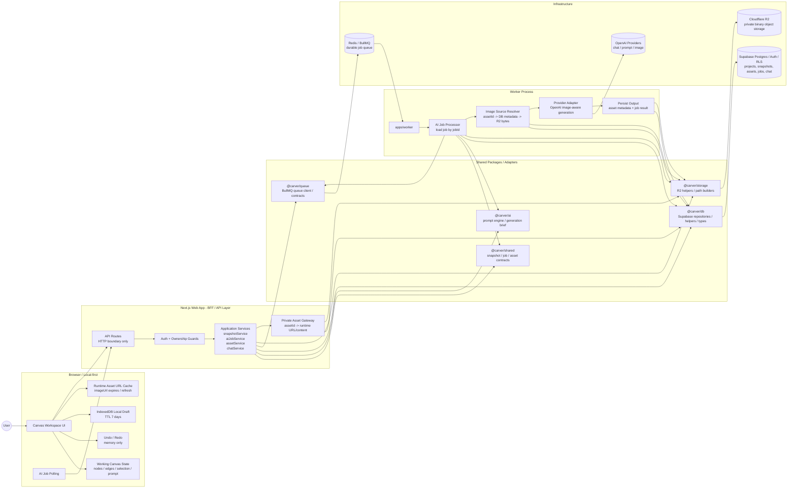

# Carver AI

Carver AI is an AI landscape design co-pilot for landscape engineers, garden studios, designers, and homeowners. It turns site photos, sketches, references, and natural-language instructions into controlled garden concepts while preserving important layout constraints such as camera angle, house and pond position, paths, materials, and locked areas.

The main product experience is a canvas-first editor: the canvas is the workspace, and AI supports the design process through chat, references, region edits, and queued image generation.

## Architecture

Carver AI uses a **Local-first AI canvas editor with a Next.js BFF, shared domain contracts, private asset gateway, and queue-driven AI worker processing.**



Key boundaries:

- The browser owns working canvas state, in-memory undo/redo, IndexedDB local drafts, and runtime image URL caching.
- Next.js is the BFF: routes authenticate and validate requests, then delegate business logic to application services.
- Supabase stores metadata, ownership, snapshots, jobs, and chat records. Cloudflare R2 stores private binary assets.
- Redis/BullMQ is only the AI job queue. The worker receives a `jobId`, loads trusted data from Supabase, and persists results back to Supabase/R2.
- Canvas and chat persist stable `assetId` references. Asset URLs are short-lived runtime delivery URLs and are never the source of truth.
- Database snapshots are reserved for manual versions, best-effort close versions, and AI job checkpoints. Unsaved editing work stays in the browser draft.

## Getting Started

### Requirements

- Node.js `>=20.9.0`
- npm 10.x
- Supabase project with Auth and Postgres
- OpenAI API key
- Redis for local queue/worker development
- Cloudflare R2 configuration for asset workflows

### Install

```bash
npm install
```

Create local environment files from the examples where available. At minimum, configure the Supabase public URL/anon key, server service-role key, OpenAI key, Redis, and R2 values. Never commit `.env`, `.env.local`, tokens, or service credentials.

Apply database migrations from `packages/db/sql` in the order documented in [packages/db/sql/README.md](packages/db/sql/README.md).

### Run locally

Start the full development stack:

```bash
npm run dev
```

Or run the processes separately:

```bash
npm run dev --workspace=@carver/web
npm run dev --workspace=@carver/worker
```

The worker requires a reachable Redis instance and its server-side environment variables. Image generation will remain queued if Redis or the worker is unavailable.

### Verify

```bash
npm run typecheck
npm run lint
npm run build
```

## License

TODO: Add the project license.
