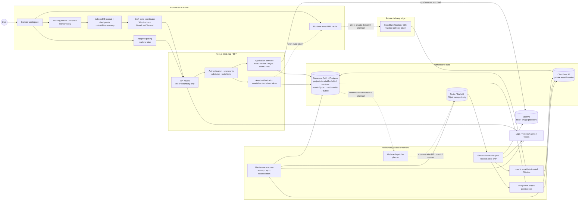
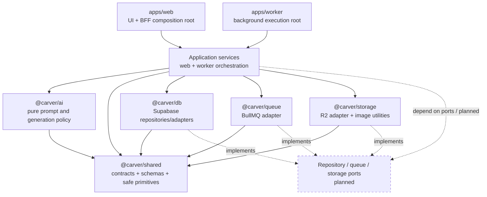
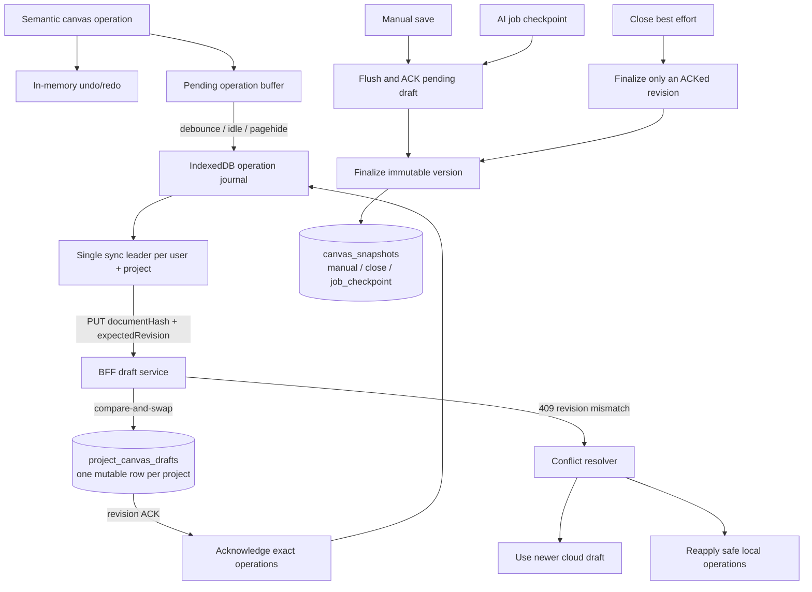
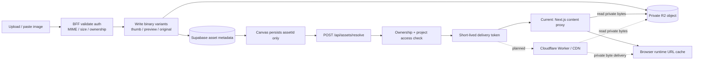
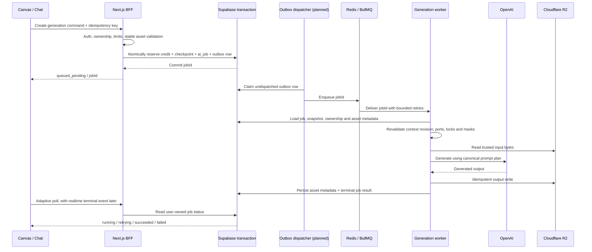
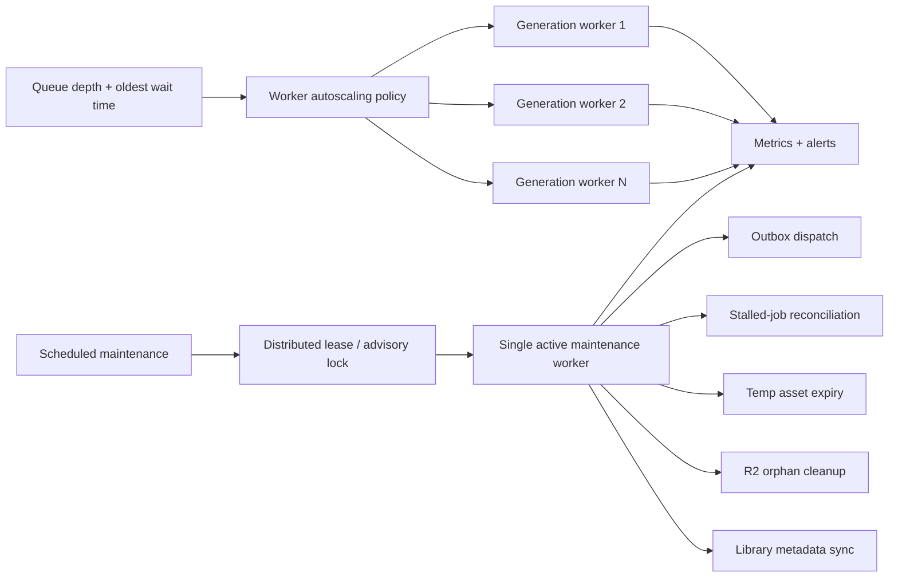

# Carver AI

Carver AI is an AI landscape design co-pilot for landscape engineers, garden studios, designers, and homeowners. It turns site photos, sketches, references, and natural-language instructions into controlled garden concepts while preserving important layout constraints such as camera angle, house and pond position, paths, materials, and locked areas.

The main product experience is a canvas-first editor: the canvas is the workspace, and AI supports the design process through chat, references, region edits, and queued image generation.

## Architecture

Carver AI uses a **local-first AI canvas editor with a Next.js BFF, shared domain contracts, private asset delivery, and queue-driven worker processing**.

The diagrams below describe the target production architecture. Solid paths are implemented or preserve the current design. Dashed paths marked `planned` are the next scalability work and must not be treated as already shipped.

### Target system architecture



### Code dependency direction

Applications compose the system. Shared contracts and pure domain logic must not import infrastructure. Infrastructure adapters may implement repository, queue, and storage concerns, but must not own product orchestration.



Dependency rules:

- API routes authenticate, parse HTTP input, and call application services. They do not contain business workflows.
- `@carver/shared` has no dependency on web, worker, DB, queue, storage, or provider SDKs.
- `@carver/ai` contains pure policy/compiler code; provider SDK and environment access remain server-only.
- `@carver/storage` should converge on R2/image concerns and stop importing the DB package directly.
- Service-role credentials stay inside server and worker composition roots.

### Canvas persistence and versioning



Persistence invariants:

- IndexedDB is the crash/offline recovery source; the mutable cloud draft is the cross-device recovery source.
- Cloud autosave updates a mutable revisioned draft and does not create version-history rows.
- Manual save, close finalize, and AI checkpoints create immutable snapshots.
- Never clear unacknowledged local operations, and never persist signed URLs, blobs, or base64 image payloads in draft documents.

### Private asset lifecycle and delivery



Asset invariants:

- `assetId` is the durable reference; runtime URLs may expire and must be refreshable.
- Ownership is checked before a delivery token is minted.
- The target scale path moves binary streaming from Vercel functions to a private edge gateway without exposing R2 paths.
- Failed metadata or binary writes require rollback or scheduled orphan cleanup.

### Reliable AI job creation and execution



Job invariants:

- BullMQ payloads contain `jobId` and non-sensitive tracing metadata only.
- Job creation, credit reservation, checkpoint creation, and outbox creation belong to one DB transaction.
- BullMQ is the retry source of truth; handlers throw typed errors and the coordinator decides terminal failure.
- Provider calls and output writes use deterministic idempotency keys to reduce duplicate charge and orphan assets.

### Worker scaling and maintenance isolation



Generation workers may scale horizontally. Periodic maintenance must either run in a dedicated process or acquire a distributed lease so multiple replicas do not execute the same sweep concurrently.

### Implementation roadmap

| Priority | Workstream | Current state | Target outcome |
| --- | --- | --- | --- |
| P0 | Architecture truth | Local draft, cloud draft, versions, and queued jobs exist | Keep diagrams and `context.md` aligned with code |
| P1 | Asset delivery edge | Next.js proxies R2 bytes | Ownership-resolved short-lived token with direct private CDN/Worker delivery |
| P1 | Transactional outbox | DB job creation then direct BullMQ enqueue with compensation | Atomic DB command plus retryable outbox dispatch |
| P1 | Maintenance isolation | Schedulers start with each worker process | Dedicated maintenance worker or distributed lease |
| P2 | Application boundaries | Several routes and storage helpers still access DB directly | Route-only HTTP boundaries and repository-backed services |
| P2 | Job status delivery | Browser polling with retry budget | Adaptive polling, then realtime terminal notifications if measured load requires it |
| P3 | Cloud draft compaction | Revisioned full-document sync | Operation/delta cloud sync only after payload and contention benchmarks justify it |

Key system boundaries:

- Browser state is disposable; recovery comes from IndexedDB first and the revisioned cloud draft second.
- Supabase stores identity, ownership, mutable drafts, immutable versions, asset metadata, jobs, chat, credits, and future outbox rows.
- R2 stores private binaries. Redis/BullMQ transports background work and is not a business-data source of truth.
- Image generation always goes through the durable job path. Synchronous BFF calls are limited to bounded operations such as text chat and prompt enhancement.
- Workers receive `jobId`, reload trusted state, and never trust canvas payloads or URLs carried in queue messages.
- The system remains a modular monolith plus workers until measured scale requires a service split.

## Getting Started

### Requirements

- Node.js `>=20.9.0`
- npm 10.x
- Supabase project with Auth and Postgres
- OpenAI API key
- Redis for local queue/worker development
- Cloudflare R2 configuration for asset workflows

### Install

```bash
npm install
```

Create local environment files from the examples where available. At minimum, configure the Supabase public URL/anon key, server service-role key, OpenAI key, Redis, and R2 values. Never commit `.env`, `.env.local`, tokens, or service credentials.

Apply database migrations from `packages/db/sql` in the order documented in [packages/db/sql/README.md](packages/db/sql/README.md).

### Run locally

Start the full development stack:

```bash
npm run dev
```

Or run the processes separately:

```bash
npm run dev --workspace=@carver/web
npm run dev --workspace=@carver/worker
```

The worker requires a reachable Redis instance and its server-side environment variables. Image generation will remain queued if Redis or the worker is unavailable.

### Verify

```bash
npm run typecheck
npm run lint
npm run build
```

## License

TODO: Add the project license.
